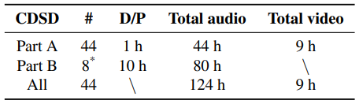
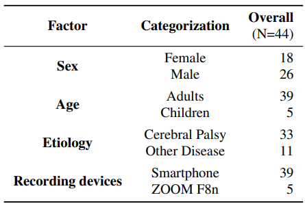

# CDSD: Chinese Dysarthria Speech Database
This repository provides scripts and trained models corresponding to the paper CDSD: Chinese Dysarthria Speech Database.

# VITS: Conditional Variational Autoencoder with Adversarial Learning for End-to-End Text-to-Speech

### Jaehyeon Kim, Jungil Kong, and Juhee Son
### Yan Wan,Mengyi Sun , Xinchen Kang , Jingting Li , Pengfei Guo , Ming Gao5 , Su-Jing Wang

In our recent [paper](https://arxiv.org/pdf/2310.15930),We released the Chinese Dysarthria Database (CDSD).

Dysarthric speech poses significant challenges for individuals with dysarthria, impacting their ability to communicate socially. Despite the widespread use of Automatic Speech Recognition (ASR), accurately recognizing dysarthric speech remains a formidable task, largely due to the limited availability of dysarthric speech data. To address this gap, we developed the Chinese Dysarthria Speech Database (CDSD), the most extensive collection of Chinese dysarthria data to date, featuring 133 hours of recordings from 44 speakers. Our benchmarks reveal a best Character Error Rate (CER) of 16.4\%. Compared to the CER of 20.45\% from our additional human experiments, Dysarthric Speech Recognition (DSR) demonstrates its potential in significant improvement of communication for individuals with dysarthria. The CDSD database will be made publicly available at this http URL(http://melab.psych.ac.cn/CDSD.html).

We also provide the [pretrained models].

<table style="width:100%">
  <tr>
    <th>CDSD overview</th>
    <th>overall information of the speakers</th>
  </tr>
  <tr>
    <td></td>
    <td></td>
  </tr>
</table>

## Pre-requisites

## Inference Example
See [inference.ipynb](inference.ipynb)
